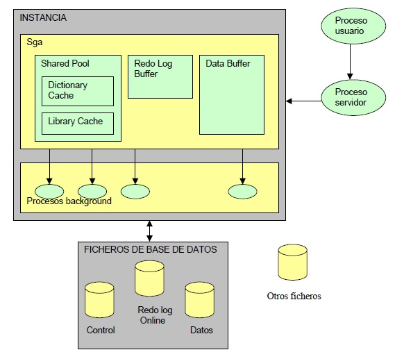

Arquitectura física
========================
Para la arquitectura física de la base de datos este manual se basará en la arquitectura física del gestor de bases de bases de datos Oracle esto porque se decidió que para la explicación de todo el diseño e implementación de la base de los datos se va a realizar con el gestor de bases de datos Oracle. A continuación se explica la forma en que se encontrará distribuida la arquitectura física, así como también  pasos a seguir para crear nuevos archivos log iniciales. Además de explicar cómo realizar multiplicación y mantenimiento de los grupos y miembros redo log online. Finalmente se mencionan algunos problemas típicos relacionados a la arquitectura física así como también recomendaciones para los mismos.

La arquitectura física de Oracle tiene tres componentes básicos:

1. La estructura de memoria
2. Los procesos 
3. Los archivos

   
**1. Estructura de memoria**
-----------------------------
^^^^^^^^^^^^^^^^^^^^^^^^^^^^^^

La estructura de la memoria de Oracle está formada por dos áreas de memoria llamada:

• SGA (Área Global del Sistema): Asignada al iniciar la instancia y componente fundamental de una instancia Oracle.
• PGA (Área Global de Programas): Asignada al iniciar el proceso de servidor SGA (System Global Area).

El SGA es un área de memoria compartida que se utiliza para almacenar información de control y de datos de la instancia. Se crea cuando la instancia es levantada y se borra cuando ésta se deja de usar (cuando se hace shutdown). 

La información que se almacena en esta área consiste de los siguientes elementos, cada uno de ellos con un tamaño fijo:

- Shared Pool

- Database Buffer 

- Redo Log Buffer

El tamaño de estos componentes del SGA pueden ser administrados manualmente o automáticamente. Si se escoge administrar manualmente estos componentes, se debe especificar el tamaño de cada uno de ellos aumentando o disminuyendo el tamaño de ellos según las necesidades de la aplicación. Si los estos componentes son administrados automáticamente, la instancia por si misma monitorea la utilización de cada componente de la SGA y ajusta sus tamaños. Independiente si la administración de la SGA es automática o manual, Oracle asigna o designa espacio dinámico dentro de la SGA dividiendo la SGA dentro de unidades llamadas granules. Dependiendo del sistema operativo donde reside el motor de base de datos Oracle, los granules pueden ser de 4 MB, 8 MB o 16 MB.

En principio podría, se podría subconfigurar la caché de buffers.

**SHARED POOL**

Almacena el DICCIONARIO DE DATOS (DATA DICTIONARY CACHE) y las sentencias SQL más recientemente utilizadas (SHARED SQL o LIBRARY CACHE). Es donde tiene lugar la fase de PARSING o ANALISIS de las sentencias SQL. Para definir su tamaño se realiza con el parámetro SHARED_POOL_SIZE del fichero de parámetros INIT.ORA y **no debería ser mayor al 50% de la memoria disponible de la máquina**.::

 ALTER SYSTEM SET SHARED_POOL_SIZE = 64 MB;

**Database buffer**

Almacena los datos más recientemente utilizados. Si al hacer una petición al sistema, los datos están ya en memoria por una petición anterior, se evita una entrada a disco, por lo que el rendimiento será mejor (compartir información). El tamaño del buffer se define en el parámetro ``DB_BLOCK_BUFFERS``. También contiene los BUFFER DE ROLLBACK, que almacenan la imagen anterior de los datos, y que proporcionan consistencia en lectura.

**Redo log buffer**

Son de acceso secuencial y graban todos los cambios hechos a la base de datos por operaciones de insert, update, delte, creat, alter y drop con el mínimo de información necesaria. Su función es la de proporcionar seguridad, frente a una caída de la BD. Su tamaño se define con el parámetro ``LOG_BUFFER``. 

La SGA se gestiona mediante el algoritmo LRU, las sentencias y datos menos recientemente utilizados son eliminados de la memoria para permitir la entrada de nuevos datos.:: 

 SQL > SHOW SGA;
 SQL > SELECT * from V$SGA;

Si por circunstancias especiales debemos vaciar toda la SGA de sus estructuras, podemos hacerlo    con la orden::

 ALTER SYSTEM FLUSH SHARED POOL;

 
 
**2. Procesos**
-----------------------------
^^^^^^^^^^^^^^^^^^^^^^^^^^^^^^

Los procesos son programas que se ejecutan para permitir el acceso a los datos, se cargan en memoria y son transportados para los usuarios. Se clasifican en tres grupos:

**Proceso de usuario:**

Es un proceso que se crea cuando un usuario establece una conexión con la base de datos. Se encarga de ejecutar el código de aplicación del usuario y manejar el perfil del usuario con sus variables de ambiente. Estos procesos no se pueden comunicar directamente con la base de datos, por lo que la comunicación la establecen mediante procesos de servidores.

Oracle puede configurarse para variar el número procesos usuario por proceso servidor. En una configuración de servidor dedicado, un proceso servidor manipula las peticiones de un único proceso usuario. En una configuración de servidor multi-línea se permite a varios procesos de usuario compartir un pequeño número de procesos servidores, minimizando el número de procesos servidores y maximizando la utilización de los recursos del sistema disponibles.

**Proceso servidor:**

También se crea uno por conexión de usuario. Se crea en el servidor y se encarga de comunicar el proceso de usuario con la instancia de la base de datos. Estos procesos ejecutan las órdenes SQL de los usuarios y llevan los datos del buffer caché para que los procesos de usuario puedan tener acceso a los datos.

En algunos sistemas, los procesos de usuario y servidores están separados, mientras que en otros se combinan en un único proceso. Si un sistema utiliza el servidor multi-línea o, si los procesos de usuario y servidores corren en diferentes máquinas, ambos procesos deben estar separados.

**Procesos background (Segundo plano).**

Son procesos de sistema, encargados de ejecutar las funciones comunes que son necesarias para el servicio de respuesta a los usuarios. Dependen de la configuración del server. 

Hay cinco obligatorios:

• Monitorización de procesos (PMON)

Recupera el proceso cuando hay un fallo en el proceso usuario. Libera la cache y libera los recursos asignados a ese proceso usuario.

• Monitorización del sistema (SMON)

Recupera la instancia (lee el controlfile). Limpia los segmentos temporales no usados y recupera las transacciones ante una caída del sistema. Compacta el espacio libre en los ficheros de datos.

• Escritura en la base de datos (DBWR)

Escribe los datos modificados del buffer de datos a los ficheros de datos.

• Escritura de la traza (LGWR)

Graba los cambios que se registran en el buffer de redo log a los ficheros de redo log.

• Punto de sincronismo (checkpoint o CKPT)

Modifica el estado de la información de la BD (cabeceras de ficheros), cuando hay un checkpoint o un log switch(llenado de redo log).

Entre los procesos opcionales en segundo plano están: ARCn, LMDN, QMNn, RECO, LMS, LCKn, LMON.

**3. Archivos**
--------------------
^^^^^^^^^^^^^^^^^^^^

Estos archivos guardan información tanto de los datos almacenados en la BD como la necesaria para gobernar la propia BD. Son 3 tipos de archivos o ficheros:

- Los Archivos de Datos (Datafiles)
- Archivos de Control (Control  files)
- Archivos de Rehacer (redo log files)

Además, hay archivos fuera de línea (Archived files), que son archivos opcionales donde se pueda guardar información vieja de los archivos de rehacer, convenientes para respaldos de base de datos

**3.1 Archivos de Datos (Datafiles):**

Sirve para el almacenamiento físico del Diccionario de Datos, las tablas, índices, procedimientos y la imagen anterior de los bloques de datos que se han modificado en las transacciones (segmentos de rollback). Estos archivos son los únicos que contienen los datos de los usuarios de la base de datos. Se pueden tener sólo uno o cientos de ellos.

El número máximo de datafiles que pueden ser configurados está limitado por el parámetro de sistema ``MAXDATAFILES``.

Si se decide que utilice varios datafiles, el administrador del sistema puede gestionar que éstos queden localizados en discos diferentes, lo que aumentará el rendimiento del sistema, principalmente por la mejora en la distribución de la carga de entrada / salida.
Para obtener información de los Archivos de Datos, consultar la tabla ``DBA_DATA_FILES``.

**3.2 Archivos de Rehacer (redo log files):**

Tienen los cambios que se han hecho a la base de datos para recuperar fallas o para manejar transacciones. Debe estar conformado por dos grupos como mínimo y cada grupo debe estar en discos separados. El principal propósito de estos archivos es de servir de respaldo de los datos en la memoria RAM.

Para establecer el tamaño apropiado de un archivo de este tipo deberá considerarse el tamaño del dispositivo que contendrá el respaldo del redo log.

Mínimo deben existir 2, aunque la instalación por defecto es de 3. Se recomienda trabajar con ficheros de Redo Log MULTIPLEXADOS en espejo, de forma que la información es escrita en varios ficheros, a ser posible en distintos discos.

Se puede configurar la base de datos para que mantenga copias de los archivos redo log online de forma que se evite la pérdida de información ante un fallo.

La base de datos contendrá grupos redo log online cuyos miembros son los archivos redo log online en sí. Los miembros de un grupo son copias idénticas de los archivos redo log online.

Un aspecto a tener en cuenta es el tamaño de los ficheros redo log. Si son muy pequeños, el LGWR deberá cambiar de ficheros demasiado frecuentemente, lo que reduce su rendimiento. Por otro lado, si los ficheros redo log son demasiado grandes, se necesitará mucho tiempo en las recuperaciones, ya que se tendrán que recuperar muchas transacciones. Oracle recomienda que se les dé un tamaño que permita que cada redo log tarde en llenarse unos 15 ó 20 minutos.
Otro aspecto muy importante es la elección del número correcto de grupos, ya que disponer de demasiados pocos grupos puede acarrear problemas cuando estámos en modos ARCHIVELOG y tenemos una tasa de transacciones muy alta. Esto puede suponer que un grupo que todavía está archivando por el proceso ARCH se convierta en el grupo en el que el LGWR necesite escribir, lo que produciría que la BD se parara, ya que el LGWR tienen que esperar a que el grupo esté disponible, una vez que su contenido ha sido archivado. Para la mayoría de las implantaciones, tener entre 2 y 10 grupos puede ser suficiente. El número de grupos no puede exceder de ``MAXLOGFILES``, ni el número de miembros puede ser mayor que ``MAXLOGMEMBERS``.

**3.2.1 Grupos redo log online**

• Un grupo redo log online es un juego de copias idénticas de un archivo de redo log online.
• El proceso en segundo plano LGWR escribe simultáneamente en todos los ficheros redo log online de un grupo la misma información.
• El servidor necesita como mínimo dos grupos redo log online con un miembro cada uno para que el funcionamiento de la base de datos sea normal.

**3.2.2 Miembros redo log online**

• Cada archivo redo log online de un grupo se denomina miembro.
• Cada miembro de un grupo tiene números de secuencia de log idénticos y el mismo tamaño. El número de secuencia de log se asigna cada vez que el servidor comienza a escribir en un grupo de log para identificar cada archivo redo log de forma única. El número de secuencia se almacena en el archivo de control y en la cabecera de todos los archivos de datos.

**3.2.3 Creación de archivos log iniciales**

El juego inicial de grupos y miembros redo log online se crea durante la creación de la base de datos al lanzar la sentencia CREATE DATABASE.
Ejemplo::
 
 CREATE DATABASE newtest
           LOGFILE
                 GROUP 1
                       (‘diskb log1b.log’,
                       ‘diskc log1c.log’)
                         SIZE 5000K,
                 GROUP 2
                        (‘diskb log2b.log’,
                         ‘diskc log2c.log’)
                           SIZE 5000K,
            MAXLOGFILES 5 ........

Hay algunos parámetros que afectan a los grupos y miembros redo log online:

• ``MAXLOGFILES``: en el comando ``CREATE DATABASE``, especifica el máximo absoluto de grupos redo log online.
• ``MAXLOGMEMBERS``: en el comando ``CREATE DATABASE``, especifica el número máximo de miembros por grupo.
• ``LOG_FILES``: parámetro de inicialización que define el número máximo actual de grupos redo log online que se pueden abrir en tiempo de ejecución (no puede exceder el parámetro ``MAXLOGFILES``).

**3.2.4 Multiplexación y mantenimiento de los grupos y miembros**

Una vez creada la base de datos, puede ser necesario añadir nuevos grupos redo log online o añadir nuevos miembros a grupos ya existentes.

**Cómo añadir un nuevo grupo redo log online**

Para añadir un nuevo grupo de redo log online debe utilizar el siguiente comando SQL::

 ALTER DATABASE [n_database]
 ADD LOGFILE [GROUP n] espec_fichero

La identificación del grupo (n) se puede omitir y será el servidor el que asigne el identificador correspondiente. Deberá especificar al menos un miembro para el nuevo grupo añadido a la base de datos.

**Cómo añadir un nuevo miembro redo log online**

Otra posibilidad que le ofrece el servidor Oracle es añadir nuevos miembros redo log online a grupos redo log existentes. El comando SQL para realizar esta acción es la siguiente::

 ALTER DATABASE [n_database]
 ADD LOGFILE MEMBER espec_fichero [REUSE]
 TO GROUP n

Si el archivo ya existe, debe utilizar la opción REUSE y debe ser del mismo tamaño que los otros miembros del grupo.

**Cómo cambiar el nombre a un miembro redo log online**

Para cambiar la ubicación de archivos redo log online basta con cambiar el nombre al archivo especificando la nueva ubicación. Antes de cambiar el nombre de un archivo redo  log online, asegúrese de que el nuevo archivo exista en la ubicación correspondiente. Oracle sólo cambia los punteros a los archivos, no crea físicamente ningún archivo del sistema operativo. La sentencia SQL para cambiar el nombre a un archivo redo log online es::

 ALTER DATABASE [n_database]
 RENAME FILE ‘espec_fichero’
 TO ‘espec_fichero’

**3.2.5 Tamaño de los archivos redo log online**

En primer lugar, un archivo redo log online debe ser como mínimo de 50KB. El tamaño máximo lo determina el sistema operativo. Los miembros de grupos diferentes podrán tener diferente tamaño pero esto no tiene ninguna ventaja.

Los siguientes aspectos pueden influir en la configuración de los archivos redo log online:

• Número de cambios de log y puntos de control.
• Número y cantidad de registros de redo.
• Cantidad de espacio en el medio de almacenamiento.

Debe procurar tener una configuración simétrica: mismo número de miembros por grupo y mismo tamaño.

**3.3 Archivos de Control (Control  files):**
 
Tiene la descripción física y dirección de los archivos para el arranque correcto de la base de datos. Mantienen la información física de todos los ficheros que forman la BD, camino incluido; así como el estado actual de la BD. Son utilizados para mantener la consistencia interna y guiar las operaciones de recuperación. Son imprescindibles para que la BD se pueda arrancar y deben encontrarse siempre protegidos. Contienen:

-	Infomación de arranque y parada de la BD.
-	Nombres de los archivos de la BD y redo log.
-	Información sobre los checkpoints. 
-	Fecha de creación y nombre de la BD.
-	Estado online y offline de los archivos.

Los ficheros de control se crean durante la instalación del producto ORACLE y deben ser siempre accesibles cada vez que sea arrancada la Base de Datos.

Debe haber múltiples copias en distintos discos, mínimo dos, para protegerlos de los fallos de disco. La lista de los ficheros de control se encuentra en el parámetro ``CONTROL_FILES``, que debe modificarse con la BD parada. 

**3.3.1 Gestionando los Ficheros de Control**

El parámetro CONTROL_FILES del fichero contiene la lista de todos los ficheros de control. 

Para protegerlos contra fallos de almacenamiento, se sugiere que al menos existan dos ficheros de control, cada uno en un disco diferente, aunque es buena idea mantener más copias en diferentes discos. Esto es una política de espejado que protege frente a fallos en disco. Si un disco falla y se pierden todos los ficheros en él, se puede seguir utilizando los ficheros de control de otros discos. Esto supone una pequeña sobrecarga al sistema, ya que cada vez que se produce un checkpoint o cambia el esquema de la BD, todos los ficheros de control son actualizados.

Si un fallo ha producido la pérdida de todas las copias de los ficheros de control habrá que recrearlos con el comando *create controlfile*. Si algunos de los parámetros ``MAXLOGFILES``, ``MAXLOGMEMBERS``, ``MAXLOGHISTORY`` , ``MAXDATAFILES`` y ``MAXINSTANCES`` varía habrá que utilizar también el comando ``CREATE CONTROLFILE``.

**3.3.2Multiplexación del archivo de control**

Oracle permite tener múltiples e idénticos archivos de control de forma simultánea. Es aconsejable tener 3 copias del archivo y a ser posible en discos diferentes.

Puede realizar la multiplexación del archivo de control:

-	Creando múltiples archivos de control al crear la base de datos.   
-	Agregando archivos de control una vez creada la base de datos.

**Al crear la base de datos**

Es el método más sencillo para tener múltiples archivos de control. La forma de hacerlo es indicar los diferentes archivos en el parámetro de inicialización ``CONTROL_FILES`` antes de crear la base de datos.

El servidor Oracle creará todos los archivos indicados en la ubicación correspondiente (al indicar los nombres de los ficheros hay que añadir la ruta completa).
Una vez creada la base de datos

Para agregar un archivo de control una vez ya creada la base de datos, debe realizar los siguientes pasos:

1. Cerrar la base de datos.
2. Copiar el archivo de control desde el sistema operativo a las ubicaciones elegidas.
3. Modificar el archivo de parámetros añadiendo en el parámetro ``CONTROL_FILES`` los nuevos archivos…
4. Iniciar la base de datos.

**Problemas tipicos y recomendaciones**

- Los puntos críticos de fallos son el CONTROL FILE y los Ficheros de REDO LOG. 

- Si se pierde el fichero de redo log en uso, sólo un backup completo de la base de datos la recuperaría hasta ese momento.

- Si falla otro de los ficheros de redo log, Oracle lo ignora y pasaría a otro, por lo que es importante que existan 3 o 4.

- El tamaño de los ficheros de redo log depende mucho de cada situación. Si es muy grande, en un recovery, tardaría mucho tiempo en arrancar.

- Oracle recomienda que se les dé un tamaño que permita que cada redo log tarde en llenarse unos 15 ó 20 minutos.

- Se pueden añadir redo log online (flexibilidad de Oracle).

- Respecto al control file es interesante tener una copia guardada en otro dispositivo. En caso de fallo, modificando en el init.ora el fichero de control con el debe arrancar, leería ese control file.

**Ejemplo de una creación de una base de datos aplicando tópicos anteriormente mencionados sobre la arquitectura física**

Antes de crear una base de datos debemos determinar dos variables importantes en el sistema operativo: ``ORACLE_HOME`` (directorio raíz para Oracle) y ``ORACLE_SID`` (Identificador de la base de datos para el sistema operativo, suele coincidir con el nombre que le vayamos a asignar a la base de datos).

En primer lugar, debemos arrancar la instancia de la base de datos. Para esto debemos conectarnos a SQLPlus con permisos de administrador de la siguiente forma::

 C:\sqlplus / as sysdba

Una vez en el entorno de sqlplus, arrancaremos la instancia de la base de datos. Para esto tendremos que haber creado el fichero de parámetros ``INITsid.ora``. Del archivo de parámetros debe especificar como mínimo los siguientes parámetros antes de iniciar la instancia:

• ``DB_NAME``: Identificador de la base de datos de ocho o menos caracteres. No es necesario que coincida con la variable ``ORACLE_SID`` del sistema operativo aunque es recomendable que sí sean iguales. El parámetro ``DB_NAME`` debe coincidir con el nombre que se utilice posteriormente en la sentencia ``CREATE DATABASE``.
• ``CONTROL_FILES``: Especifica una lista de archivos de control. Como mínimo debería especificar dos nombres de archivo de control situados en discos diferentes si es posible. No es necesario que existan dichos archivos físicamente.
• ``DB_BLOCK_SIZE``: Determina el tamaño de bloque de base de datos. Debe ser un múltiplo del tamaño de bloque del sistema operativo. 

El comando para iniciar la instancia desde el entorno SQLPlus es::
 
 Sqlplus> startup nomount pfile=’fich_param’

A continuación hay que crear la base de datos. Una Base de Datos se crea mediante la sentencia *CREATE DATABASE*, después de arrancar una Instancia.::

 CREATE DATABASE PRUEBA
 [CONTROLFILE REUSE]
 DATAFILE ‘ORA1.DBF’ SIZE 20M [REUSE]
 LOGFILE ‘LOG1.DBF’ SIZE 500K [REUSE],
 ‘LOG2.DBF’ SIZE 500K [REUSE]
 [MAXDATAFILES 100]
 [MAXLOGFILES 16]
 [MAXLOGMEMBERS 3]
 [ARCHIVELOG | NOARCHIVELOG]
 [CHARACTER SET WE8DEC]
 [MAXLOGHISTORY 100]

• ``MAXLOGFILES``: Número máximo de ficheros de Redo Log. Dependiente del sistema operativo.
• ``MAXDATAFILES``: Número máximo de ficheros de Base de Datos. Dependiente del sistema operativo.
• ``REUSE``: Si al crear la Base de Datos, existe ya alguno de los ficheros, los reutiliza perdiendo su contenido anterior.
• ``MAXLOGHISTORY``: Número máximo de ficheros redo log que pueden ser recogidos en el registro histórico del archivo de control. Se recomienda dar el valor 0, para no activar el registro histórico., que se usa para la recuperación automática de media de un servidor paralelo. Su valor máximo es de 65535.
• Deben utilizarse múltiples archivos de control en discos distintos. Los nombres de los archivos de control se especifican por medio del parámetro ``CONTROL_FILES`` del ``INIT.ORA``.

Cuando finaliza el comando ``CREATE DATABASE`` implícitamente se realiza la apertura de la base de datos. 

**Modificación de la Base de Datos** 

Primero se arranca la B.D. por pasos hasta realizar un:

``ALTER DATABASE TEST MOUNT``

• Funciones Adicionales:

  ``ALTER DATABASE ADD LOGFILE`` ``nombre_fichero`` ``[REUSE]``

 ``ALTER DATABSE DROP LOGFILE`` ``nombre_fichero``

 ``ALTER DATABASE RENAME FILE`` ``nom_antiguo TO nom_nuevo``

 ``ALTER DATABASE ARCHIVELOG/NOARCHIVELOG``

 ``ALTER DATABASE BACKUP CONTROLFILE TO TRACE``

• Después de realizar la función necesaria:

``ALTER DATABASE OPEN``

-	 ``ALTER DATABASE DISMOUNT``
-	 ``ALTER DATABASE CLOSE``

**Estándar de documentación**
-------------------------------
^^^^^^^^^^^^^^^^^^^^^^^^^^^^^^^

A continuación se dan las pautas para realizar la documentación de la arquitectura física.
 
1.	Realizar un diagrama en donde se aprecie claramente la estructura física de la base de datos.
2.	Especificar cada uno de los ficheros físicos junto con el  espacio de la memoria con que cuentan  cada uno de ellos.
3.	Especificar los procesos de usuario y explicar en qué consiste cada uno de ellos.
4.	Documentar los Grupos redo log online y en ellos especificar cada uno de sus miembros redo log. Así como también se debe actualizar esta parte cada vez que se dé la creación de un miembro redo log.
5.	Documentar los archivos de control, su contenido y como fue designada la multiplexación de estos archivos. También si se crean archivos de control nuevos después de crear la base de datos estos deben ser documentados.
6.	Documentar los  archivos de datos y su contenido.
7.	Finalmente en caso de agregar nuevos ficheros físicos documentar los cambios hechas para mantener está parte de la documentación de la base datos actualizada.
