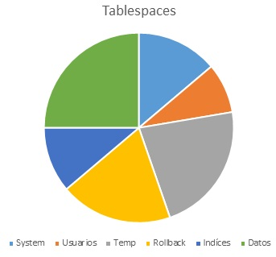

Arquitectura lógica
===================

**Introducción**
-----------------------------
^^^^^^^^^^^^^^^^^^^^^^^^^^^^^^

Una Base de Datos se divide en unidades de almacenamiento lógicas llamadas Tablespaces. Contienen distintos objetos relacionados, como las tablas de una misma base de datos. Cada base de datos está formada por uno o más tablespaces, donde al menos debe existir el tablespace SYSTEM (diccionario de datos).

Una base de datos Oracle contiene como mínimo un tablespace, SYSTEM se crea automáticamente.
Un tablespace contiene uno o más segmentos, cada tablespace se corresponde con uno o más ficheros de datos.

Cada segmento está formado por extensiones, que son divisiones lógicas.

Una extensión está formada por bloques lógicos, así es como se asigna el espacio.

Un bloque es una unidad más pequeña para las operaciones de lectura y escritura.

Imagen 01: representación gráfica de la distribución de la estructura lógica de las tablespace.

**Tipos de datos**
-----------------------------
^^^^^^^^^^^^^^^^^^^^^^^^^^^^^^

Los tipos de datos soportados por Oracle se agrupan en los siguientes conjuntos.

•	Alfanuméricos

	``CHAR``
 
	``VARCHAR2``

	``VARCHAR``

	``NCHAR``

	``NVARCHAR2``

	``LONG``

•	Numéricos

	``NUMBER``

	``FLOAT``

•	Fecha

	``DATE``

•	Bianarios

	``RAW``

	``LONG RAW``

	``BLOB``

	``CLOB``

	``BLOB``

	``BFILE``

•	Otros

	``ROWID``

**TIPOS DE DATOS ALFANUMÉRICOS**

•	Tipo de dato ``CHAR(n)``: Almacena cadenas de caracteres de longitud fija.Su rango está entre 1 y 2.000 bytes de ocupación.
•	Tipo de dato ``VARCHAR2(n)``: Almacena cadenas de caracteres de longitud variable.
•	Tipo de dato ``VARCHAR(n)``: En Oracle8 es equivalente a VARCHAR2.
•	Tipo de dato ``NCHAR(n)``: Almacena un valor alfanumérico de longitud fija. Puede almacenar caracteres ASCII, EBCDIC, UNICODE...
•	Tipo de dato ``NVARCHAR2(n)``: Almacena un valor alfanumérico de longitud variable. Puede almacenar caracteres ASCII, EBCDIC, UNICODE...

 
**TIPOS DE DATOS NUMÉRICOS**

•	Tipo de dato ``NUMBER(p, s)``: Almacena valores numéricos en punto flotante que pueden estar entre 1.0 x 10-130 y 9.9...(38 nueves).
•	Tipo de dato ``FLOAT(N)``: Almacena un número en punto decimal sin restricción de dígitos decimales, donde n indica la precisión binaria máxima que puede moverse en el rango 1 a 126.

**TIPOS DE DATOS FECHA**

•	Tipo de dato ``DATE``: Almacena un valor de fecha y hora. Para un tipo de dato ``DATE``, Oracle almacena internamente los siguientes datos:

	Siglo

	Año

	Mes

	Día

	Hora

	Minuto

	Segundo

El formato por defecto de las fechas es: ``'DD-MON-YYYY'``

**TIPO DE DATOS BINARIOS**

•	Tipos de datos binarios: Permiten almacenar información en formato "crudo", valores binarios tal y como se almacenan en el disco duro o como residen en memoria.
•	Tipo de dato ``LONG`` : Almacena caracteres de longitud variable hasta 2Gb. En Oracle8 y siguientes versiones se deben usar los tipos de datos ``CLOB`` y ``NLOB`` para almacenar grandes cantidades de datos alfanuméricos.

**OTROS TIPOS DE DATOS**

•	Tipo de dato ``ROWID``: Representa una dirección de la base de datos, ocupada por una única fila. Este tipo de dato sirve para guardar punteros a filas concretas.

**Almacenamiento en una Base de Datos Oracle**
-----------------------------
^^^^^^^^^^^^^^^^^^^^^^^^^^^^^^

Oracle define “esquema” como la colección de estructuras lógicas que corresponden a los datos almacenados, y crea un nuevo esquema por cada usuario que crea objetos en la base de datos. No hay ninguna relación directa entre tablespace y esquema, objetos del mismo esquema pueden estar en diferentes tablespaces y un mismo tablespace puede almacenar distintos esquemas.

El control del uso del espacio del disco se obtiene mediante las estructuras lógicas de almacenamiento: bloque de datos, extensión y segmento. El nivel más pequeño de a nivel de la base de datos es el del bloque de datos.

El almacenamiento en Oracle se maneja con cinco conceptos:

•	Tablespace
•	Datafile
•	Segment (segmento)
•	Extend (extensiones)
•	Data block (bloque de datos / paginas)

   Imagen 02: Esquema extraído del Oracle8 Concepts. representación gráfica de la distribución lógica de la memoria por segmento, extensión y bloques de memoria.
   
   
**Tablespace**

La distribución lógica de los datos está asociada directamente con la eficiencia de la base de datos, por eso es que se manejan varios tipos de datos de las tablespace. Se pueden tener tantos tablespace como sea necesario.

Las propiedades que se asocian a un tablespace cuando un objeto es creado dentro de un tablespace, hereda:

•	Localización de los ficheros de datos
•	Especificación de consumo de disco.
•	Control de disponibilidad de datos
•	Backup de datos

A continuación se muestra la distribución de tablespace que se designa para la base de datos la cual es la siguiente.

•	System (Diccionario de datos)
•	Usuarios
•	Temp 
•	Rollback
•	Indices
•	Data 

Imagen 03: posible distribución de las tablas en la memoria. Cada color representa tablas en distintos discos.

Si todos los datos están en el mismo espacio de memoria, podrían existir varios problemas, entre ellos problemas de seguridad, al tener todos los datos en el mismo disco, por ejemplo, el disco C. Si el sistema operativo falla, se cae la base de datos o hay problemas físicos con el disco, todos los datos se perderían, aun teniendo una tabla de respaldo, pues se encuentra en la misma distribución de la memoria. Una posible solución al problema de tener todo en System o en el mismo disco, es distribuir en diferentes memorias, una tabla podría ir en C:\, otro en D:\, otro en F:\, sería más fácil respaldar la información así.

A continuación se explica con más detalle cada uno de los tablespaces designados así como su contenido.

**System ( Diccionario de datos )**

El tablespace system será destinado para el diccionario datos el cual contiene toda la información de las tablas  como nombres de columnas, cantidad de columnas, atributos, tipos de datos y otros datos importantes para la base de datos. Así como también serán almacenados catálogos de componentes PL/SQL creados para el control de los mismos, más adelante  en el apartado de PL/SQL se explicará un poco más a fondo el contenido de estos catálogos de programación. Además, es importante tener en cuenta que el espacio de tablas SYSTEM esté al 50% o 75% de su espacio disponible. Finalmente, asegurarse de que los usuarios no tienen privilegios de escritura en el espacio de tablas SYSTEM, solo un usuario de tipo administrador de sistema debe poder modificar estos registros.

**Usuarios**

Este tablespace será utilizado para almacenar la información de todos los usuarios que utilicen las bases de datos, para así poder consultarlos y poder asígnales ciertos permisos, recursos o procedimientos.

**Temp**

Ciertas operaciones, necesitan de espacio en disco para poder realizarse. El espacio reservado se denomina “segmentos temporales”. Se pueden crear segmentos temporales cuando:

•	Se crea un índice.
•	Se utiliza ``ORDER BY``, ``DISTINTC`` o ``GROUP BY`` en un ``SELECT``.
•	Se utilizan los operadores ``UNION``, ``INTERSECT`` o ``MINUS``.
•	Se utilizan ``joins`` entre tablas.
•	Se utilizan subconsultas.

El tablespace temporal será destinado a todos aquellos datos temporales que ayudaran a mejorar el rendimiento de acceso a registros en la base de datos. Esto porque este espacio es de vital importancia para realizar operaciones en las que se lleve a cabo ordenamientos. También para  la   creación y  análisis  de índices para calcularles estadísticas. En los casos anteriores cuando el servidor no encuentre espacio suficiente libre en memoria utilizara el tablespace temp. También es importante mencionar que los rendimientos son muy superiores en comparación con otros tiempos de tablespaces normales. Esto dado que manera en que se utiliza este tablespace es orientado a objetos que crecen muy rápido y que a continuación rápidamente disminuyen su tamaño y desaparecen.

**Rollback**

El tablespace rollback será utilizado para almacenar todas las bitácoras correspondientes a las transacciones hechas en la base de datos esto con el fin de mantener una copia de seguridad en caso de fallo en la base de datos.

**Índices (index)**

Este tablespace será destinado a los índices de tablas. También es importante tomar en cuenta que los índices crecen en tamaño en mayor proporción que las tablas asociadas si los datos en la tabla son modificados frecuentemente. La gestión del espacio es mejor si se mantienen los índices de tablas grandes en espacios de tablas separados.

**Data**

Este tablespace  se utilizara para almacenar los registros de todas las tablas almacenadas en la base de datos. Dado el crecimiento de la cantidad de registros por tabla es recomendable prever un espacio grande para el datafile que se encuentre relacionado a este tablespace.

A continuación algunos otros datos importantes en relación a los tablespaces.

**Datafile**

Un datafile son los "ficheros de datos" donde se almacena la información físicamente, este puede tener cualquier nombre y extensión, y puede estar localizado en cualquier directorio del disco duro, además está asociado a un solo tablespace y un tablespace está asociado a uno o varios datafiles.

Los datafiles tienen una propiedad llamada ``AUTOEXTEND``, que en dado caso de que está activa, esta se encarga de que el datafile crezca automáticamente cada vez que se necesite espacio y no exista. Aunque el datafile este vacío, este tiene el tamaño en disco que ha sido indicado en su creación o el que el sistema le ha dado por defecto. Oracle hace esto para direccionar espacio continuo en disco y evitar así la fragmentación. Cuando se vayan creando objetos en ese tablespace, se va ocupando el espacio a donde se direccionó la memoria.

**Segment**

Un segment (segmento) es aquel espacio direccionado por la base de datos dentro de un datafile para ser utilizado por un solo objeto. Así una tabla (o cualquier otro objeto) está dentro de su segment, y nunca podrá salir de él, ya que, si la tabla crece, el segment también crece. Se podría decir que el segment es la representación física de del objeto en base de datos.

Existen tres tipos de segments (principalmente):

•	Segmentos de tipo ``TABLE``: son aquellos que contienen tablas creadas en la base de datos.
•	Segmentos de tipo ``INDEX``: son aquellos que contienen índices, que contienen las direcciones de memoria donde se encuentran los datos, inicios de tablas, fin de tablas, etc.
•	Segmentos de tipo ``ROLLBACK``: son aquellos se usan para almacenar datos de información de la transacción realizada en la base para asi poder recuperar información o  tener registros.
•	Segmentos ``TEMPORALES``: aquellos que se usan para realizar operaciones temporales que no pueden realizarse en memoria, tales como ordenaciones o agrupaciones de conjuntos grandes de datos.

**Extend**

Extent es un concepto que está relacionado con cualquier objeto que ocupe espacio de disco, es decir cualquier objeto que tenga un segment relacionado, que se direcciona una sola vez en el tiempo. El concepto de extent es un concepto físico, unos extent están separados de otros dentro del disco. Una vez aclarado que todo objeto tiene un segmento asociado, pero a su vez se compone de distintas extensiones. Un segmento, puede ser reservado una sola vez, en la creación se asignan 10MB de una vez, o de varias veces 5MB hoy y 5MB mañana.

Existen dos tipos de extends:

• ``INITIAL`` (extensiones iniciales): estas son las extensiones que se direccionan en el momento de la creación del objeto. Una vez que un objeto está creado, no se puede modificar su extensión inicial.
• ``NEXT`` (siguientes o subsiguientes extensiones): toda extensión reservada después de la creación del objeto. Si el ``INITIAL EXTENT`` de una tabla está llena y se está intentando insertar más filas, se intentará crear un ``NEXT EXTENT`` (siempre y cuando el datafile tenga espacio libre y tengamos cuota de ocupación suficiente).

Sabiendo que las extensiones se crean en momentos distintos de tiempo, es lógico pensar que unas extensiones pueden estar fragmentadas de otras. Un objeto de base de datos no está todo junto dentro del bloque, sino que se secciona en tantos bloques como extensiones tenga. Por eso es crítico definir un buen tamaño de extensión inicial, ya que, si es lo suficientemente grande, el objeto nunca estará fragmentado.

Si el objeto tiene muchas extensiones y éstas están muy separadas en disco, las consultas pueden tardar mucho más, ya que las cabezas lectoras tienes que dar saltos constantemente, por eso es que las secciones se crean con bytes de memoria que están consecutivos en el disco.

El tamaño de las extensiones (tanto las ``INITIAL`` como las ``NEXT``), se definen durante la creación del objeto y no puede ser modificado después de la creación. Oracle recomienda que el tamaño del ``INITIAL EXTENT`` sea igual al tamaño del ``NEXT EXTENT``.

La mejor solución es calcular el tamaño que tendrá el objeto  ya sea una tabla o un índice, para esto se multiplica el tamaño de cada fila por una estimación del número de filas de la tabla. Este resultado es el que se debe utilizar para el tamaño de la extensión ``INITIAL`` y ``NEXT``, evitando así la fragmentación en el disco. En caso de detectar más de 10 extensiones en un objeto es recomendable crear un nuevo objeto.

**Data block**

El concepto de Data block es un concepto físico, pero de una distribución lógica, donde el número de espacio de bytes contiguos de espacio físico en el disco, se maneja como bloques de memoria, esto es llamado paginación.

El soporte de paginación en las bases de datos Oracle aumenta el desempeño de las aplicaciones de base de datos de mucha memoria, especialmente en los casos en que el caché de buffer tiene varios gigabytes de tamaño, las CPU en el sistema podrán acceder más rápidamente a los buffers en la base de datos.

Ya que los bloques de datos representan la mínima unidad de almacenamiento que es capaz de manejar Oracle. En un disco duro no es posible que un fichero pequeño ocupe menos de lo que indique la unidad de asignación, así si la unidad de asignación es de 4 Kb, ya que así fue asignado por quien creó los ficheros, un fichero que ocupe 1 Kb en realidad ocupa 4 Kb. 
