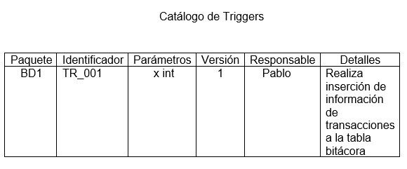
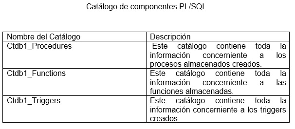

Componentes PLsql
======================

En esta sección del manual se definen algunos conceptos básicos pero muy importantes a la hora del desarrollo de los procedimientos  almacenados, funciones, trigggers y demás componentes del PL/SQL. También algunos ejemplos de los componentes PL/SQL  antes mencionados y su documentación dentro de un  catálogo. La documentación de estos componentes es muy importante por lo tanto se recomienda realizar un trabajo ordenado para facilitar el mantenimiento de  estos componentes en la base de datos. Otro aspecto importante es que los procesos y funciones almacenas  son de gran ayuda en muchas empresas ya que les facilita el trabajo en cuanto se refiere a realizar algunos cálculos empresariales, además un aspecto aún más importantes es que muchos de estos resultados que muestran las bases de datos por medio de estos componentes de programación son vitales para la toma de decisiones en muchas empresas ya que pueden indicar si una empresa está teniendo un déficit de ventas por lo cuál sea necesario  realizar un reajuste para mejorar dicha situación, esto para un empresa que se dedique a las ventas. Otro ejemplo es el uso del lanzamiento de triggers para realizar bitácoras lo cual es de bastante ayuda en casos de pérdida de información.También en una base de datos de un hospital puede ayudar a realizar estadísticas sobre enfermedades que ayuden en un futuro a combatirlas de una mejor manera. Es por ello que se hace el énfasis en realizar un buen trabajo en esta parte de la base de datos.

**PL/SQL**  es el lenguaje de programación que proporciona Oracle para extender el SQL estándar con otro tipo de instrucciones y elementos propios de los lenguajes de programación.

**Construyendo bloques de programas PL/SQL**
---------------------------------------------
^^^^^^^^^^^^^^^^^^^^^^^^^^^^^^^^^^^^^^^^^^^^^

PL/SQL es un lenguaje estructurado con bloques. Un bloque PL/SQL es definido por las palabras clave ``DECLARE``, ``BEGIN``, ``EXCEPTION``, y ``END``, que dividen el bloque en tres secciones

**1. Declarativa**: sentencias que declaran variables, constantes y otros elementos de código, que después pueden ser usados dentro del bloque

**2. Ejecutable:** sentencias que se ejecutan cuando se ejecuta el bloque

**3. Manejo de excepciones**: una sección especialmente estructurada para atrapar y manejar cualquier excepción que se produzca durante la ejecución de la sección ejecutable

Unidades que se pueden programar en una base de datos Oracle:

•	Procedimientos almacenados
•	Funciones
•	Triggers

**Conceptos Básicos**
-----------------------
^^^^^^^^^^^^^^^^^^^^^^^

**•	DELIMITADOR:** Es un símbolo, simple o compuesto, que tiene una función especial en PL/SQL:

- Operadores Aritméticos
- Operadores Lógicos
- Operadores Relacionales

**•	IDENTIFICADOR:** Son empleados para nombrar objetos de programas en PL/SQL, así como a unidades dentro del mismo: 

- Constantes
- Cursores
- Variables
- Subprogramas
- Excepciones
- Paquetes

**•	LITERAL:** Es un valor de tipo numérico, carácter, cadena o lógico no representado por un identificador (es un valor explícito).

**•	COMENTARIO:** Es una aclaración que el programador incluye en el código. Son soportados dos estilos de comentarios, el de línea simple y de multilínea, para lo cual son empleados ciertos caracteres especiales.

**Tipos de Datos**
-------------------
^^^^^^^^^^^^^^^^^^^

PL/SQL proporciona una variedad de tipos de datos para especificar el formato de almacenamiento, restricciones y rango de valores válidos de constantes y variables.A continuación una lista de los tipos de datos más comunes:

•	``NUMBER`` (numérico): Almacena números enteros o de punto flotante..

•	*CHAR* (carácter): Almacena datos de tipo carácter con un tamaño máximo de 32.767 bytes y cuyo valor de longitud por defecto es 1.

•	``VARCHAR2`` (carácter de longitud variable): Almacena datos de tipo carácter empleando sólo la cantidad necesaria aun cuando la longitud máxima sea mayor.

•	``BOOLEAN`` (lógico): Almacena valores TRUE o FALSE.

•	``DATE`` (fecha): Almacena datos de tipo fecha. Las fechas se almacenan internamente como datos numéricos, por lo cual se puede realizar operaciones aritméticas con ellas.

•	Atributos de tipo. Un atributo de tipo PL/SQL es un modificador que puede ser usado para obtener información de un objeto de la base de datos. El atributo ``%TYPE`` permite conocer el tipo de una variable, constante o campo de la base de datos. El atributo ``%ROWTYPE`` permite obtener los tipos de todos los campos de una tabla de la base de datos, de una vista o de un cursor.

**Nombres en una base Oracle**
-------------------------------
^^^^^^^^^^^^^^^^^^^^^^^^^^^^^^^

Estas son las reglas para construir identificadores válidos en una base Oracle:

• El largo máximo es de 30 caracteres.
• El primer caracter debe ser una letra, pero cada caracter después del primero puede ser una letra, un número (0 a 9), un signo de pesos ($), un guión bajo (_), o un numeral (#). Todos los siguientes son identificadores válidos.

::
 
   hola_mundo
   hola$mundo
   hola#mundo

pero estos son inválidos:
::
 
 1hola_mundo
 hola%mundo

• PL/SQL es case-insensitive (no es sensitivo a mayúsculas y minúsculas) con respecto a los identificadores. PL/SQL trata todos los siguientes como el mismo identificador

::

  hola_mundo
  Hola_Mundo
  HOLA_MUNDO

Para ofrecer más flexibilidad, Oracle permite evitar las restricciones de la segunda y tercera regla, encerrando al identificador entre comillas dobles. Un quoted identifier (identificador encerrado entre comillas) puede contener cualquier secuencia de caracteres imprimibles excluyendo las comillas dobles; las diferencias entre mayúsculas y minúsculas serán además preservadas. Así, todos los siguientes identificadores son válidos y distintos:

::

 "Abc"
 "ABC"
 "a b c"

Estas mismas reglas aplican a los nombres de los objetos de base de datos como tablas, vistas y procedimientos, con una regla adicional: a menos que se encierren entre comillas los nombres de estos objetos, Oracle los mantendrá en mayúsculas.

**Procedimientos Almacenados**
-------------------------------
^^^^^^^^^^^^^^^^^^^^^^^^^^^^^^^

A continuación se muestran algunos procesos almacenados básicos pero que en en este caso funcionan para ejemplificar como se debería dar la documentación de los mismos.
A la hora de crear los procesos almacenados es muy importante la identificación de los  mismos es preferible que se utilice un prefijo  en el identificador similar para todos  los procesos almacenados, así como también para funciones y triggers esto por ayudará  en el mantenimiento de la base de datos ya que facilitará las búsquedas de los mismos cuando se requieran hacer auditorias o sea necesario reparar un problema que se esté dando. Para estos ejemplos  se utilizará el e siguiente prefijo SP  el cual ira seguido por un consecutivo por ejemplo ``SP001`` y ``SP002`` y así sucesivamente claro está que esta escogencia del prefijo quedará a cargo de los creadores de la base de datos.

La siguiente es una tabla llamada T1 la cual se usará para ejemplificar el desarrollo de algunos procedimientos almacenados los cuales a su vez modificarán el contenido de sus registros.
::

 Create table  t1(
 a int,
 b int,
 c int   );

**Insertar**

El siguiente método se utilizará para insertar  registros dentro base de datos, en este caso específicamente en la tabla t1 , se utiliza la recomendación anteriormente mencionada sobre la asignación del identificador utilizado para el proceso almacenado en este caso se utiliza ``SP001`` más adelante en los siguientes procesos se podrá ver como se continua con un prefijo de nombre similar para los demás procesos.

::

 create or replace Procedure SP001 (x int , y int  , z int) 
 AS
 BEGIN
 INSERT into t1 (a,b,c) values(x,y,z);
 Commit;
 END;
 /

Es importante no olvidar que después de escribir el procedimiento almacenado para finalizar la operación se coloca un  / y para ejecutar un proceso se utiliza execute nombre del Proceso (variable tipo).
Ejemplo:
::

 execute  SP001(1,2,3);

**Actualizar**

El siguiente método se utilizará para realizar una actualización  algún registro dentro base de datos, en este caso específicamente al atributo a con el valor igual a 1 de la tabla T1 para este caso el nombre que se le asigna es ``SP002``  continuando así con la secuencia de nombres asignados.
::

 create or replace Procedure SP002 ( x int )
 As
 Begin
 Update T1 set a = x
 where a = 1;
 Commit;
 End;

**Eliminar**

El siguiente método se utilizará para eliminar  algún dato dentro base de datos, en este caso específicamente al atributo a con el valor igual a la variable x la cuál le es enviada por parámetro. También como en los casos anteriores  se le asigna el mismo prefijo pero con diferente consecutivo ``SP003``.
::

 create or replace Procedure SP003 ( x int )
 As 
 Begin 
 Delete from t1 where a = x;
 Commit;
 End;

A continuación se dará una referencia de como documentar los procedimientos almacenados el cual también se podrá usar para documentar otros componentes como funciones almacenadas y triggers mediante un catálogo de objetos para este primer caso será un catálogo de procedimientos almacenados. Además de documentar de manera digital este catálogo también se debe documentar a nivel de la base datos mediante la creación de una tabla específicamente hecha para esta documentación de los procesos almacenados.

.. figure:: nstatic/imgPlsq3.jpg
   :align: center

Ahora se procederá a explicar cada una de las columnas de este recuadro y los valores que contienen las filas.

- Paquete: Indica el nombre de la base de datos a la cual pertenece.
- Identificador: Es el nombre asignado al proceso almacenado para identificarlo.
- Parámetros: Contiene los parámetros del proceso así como el tipo de cada uno.
- Versión: Lo cual indica como su nombre lo dice que versión del procedimiento.
- Responsable: La columna responsable muestra quien es el responsable de dar mantenimiento a este procedimiento.
- Detalles: Detalla un poco más fondo cuál es la función principal del procedimiento almacenado.

**Funciones Almacenadas**
---------------------------
^^^^^^^^^^^^^^^^^^^^^^^^^^^

Ahora se procederá a explicar un poco del proceso de la creación y documentación de funciones almacenadas en la base datos el cuál es muy similar al anterior.

Para explicar este procedimiento se debe crear la siguiente.
::

 Create table  t2(
 d int,
 e int,
 f int
 );

**Función Sumatoria**

La siguiente función es una función almacenada que se encarga de realizar una sumatoria de la multiplicación hecha entre  dos valores de dos tablas  en este caso de las tablas t1 y t2, esta es una función muy utilizada en bases de datos que requieren cálculos diarios en bases de datos de ventas de muchas empresas. Retomando también un poco lo que es el identificador de la función se le asignó SF_001 en donde más adelante se podrá ver como se seguirá utilizando el prefijo SF_  para otra función almacenada.
::

 create or replace function SF_001(x integer) 
 return float 
 is  
 resultado float; 
 begin 
 select sum(T1.a * T2.d) 
 into resultado
 from  T1, T2
 where T1.a= x ;
 return resultado; 
 end; 
 /

**Función Suma Valor**

La siguiente función es una función almacenada que se encarga de realizar una sumatoria de un valor en la tabla  t2, esta función es similar a la anterior con la diferencia de  que es una sumatoria de la suma del valor de la columna  e de la tabla t2  respectivamente,  lo cual es una práctica utilizada para realizar cálculos por ejemplo de la suma de las ventas por un vendedor en un mes dado. De manera similar a la función anterior  el identificador de la función que se le asignó es SF_002 manteniendo la política de nombres.
::
 
 create or replace function SF_002(x integer) 
 return float 
 is 
 resultado float; 
 begin 
 select sum(T2.e)  
 into resultado
 from  T2
 where T2.d= x ;
 return resultado; 
 end; 
 /

A continuación se dará una referencia de como documentar las funciones almacenadas en un catálogo de funciones. Además de documentar de manera digital este catálogo también se debe documentar a nivel de la base datos mediante la creación de una tabla específicamente hecha para esta documentación de las funciones almacenadas.

.. figure:: nstatic/imgPlsq4.jpg
   :align: center

**Triggers**
--------------
^^^^^^^^^^^^^^
En este apartado se mostrará como crean un trigger y también la manera recomendada de documentarlos.

La siguientes tablas se crearán para ayudar al desarrollo y almacenamiento respectivamente en el trigger que será explicado en el siguiente punto.
::

 Créate table t3(
 X int ,
 Y int
 );

 create table bitacora(
 oldX int,
 oldY int,
 newX int,
 newY int,
 fechahora date,
 accion varchar(20)
 );
 
 Trigger  Bitacora TR_001

El siguiente trigger tiene como función insertar la información necesaria en la tabla bitácora. Así con dicha información en la tabla bitácora será de gran ayuda para un rollback en la base de datos o también una función aún más importante la de realizar un redo log   o copia de seguridad de las transacciones hechas en la base de datos y así colaborar en una eventual pérdida de información. Para los triggers el prefijo utilizado es ``TR_`` seguido por un  consecutivo.
::

 create or replace trigger TR_001
 after insert or update or delete
 on t3
 for each row
 begin
 IF INSERTING then
 insert into bitacora ( oldX , oldY , newX , newY , fechaHora , accion) values (:old.x , :old.y   , :new.x , :new.y ,  sysdate  , 'insert' );
 ElSIF UPDATING then
 insert into bitacora ( oldX , oldY , newX , newY , fechaHora , accion) values (:old.x , :old.y  , :new.x , :new.y ,  sysdate   , 'update' );
 ELSE
 insert into bitacora ( oldX , oldY , newX , newY , fechaHora , accion) values(:old.x, :old.y,  :new.x,:new.y,  sysdate , 'delete');
 END IF;
 end;
 /

A continuación se dará una referencia de como documentar los triggers en un catálogo. Además de documentar de manera digital este catálogo también se debe documentar a nivel de la base datos mediante la creación de una tabla específicamente hecha para esta documentación de  los triggers creados.

**Catálogo General**
-----------------------
^^^^^^^^^^^^^^^^^^^^^^^

En este último apartado se hará un ejemplo de cómo se podría realizar un catálogo general que contenga la información general de los catálogos de PL/SQL con los que cuenta la base de datos. Así mismo para ayudar a la identificación de los mismo se recomienda la utilización de un prefijo similar para todos por ejemplo en este caso se utilizará  ``ctbd1_`` seguido por el nombre de catálogo. También es importante como en los catálogos anteriores aparte de mantener este catálogo.

La idea de crear este catálogo general de los componentes PL/SQL nace a partir del punto de simular una estructura similar al diccionario de datos, sin embargo la función de este catálogo es la de facilitar el acceso de información a los administradores de bases de datos el acceso a esta información ya que por ejemplos si necesitan saber el número de catálogos  de los componentes PL/SQL creados para la base de datos basta con realizar la consulta a la base de datos.

