Modelo de datos
======================

Antes de comenzar con las indicaciones sobre cómo realizar el modelo de datos para la base de datos es importante tener bien claro que es un modelo de datos.

Un modelo de datos es un conjunto de herramientas conceptuales para la descripción de los datos y las relaciones entre ellos, su semántica y las restricciones de consistencia. Ahora bien, en este manual se utilizará el modelo de datos relacional esto dado que su simplicidad facilita el trabajo del programador en comparación con otros modelos. Sin embargo, primero se desarrollará un modelo basado en Entidad-Relación el cual después será trasformado finalmente en el Relacional, ya que E-R sirve para modelar el problema y reglas de negocio.

También a continuación se muestran algunos conceptos importantes relacionados con el diseño del modelo de bases de datos y también con respecto a integridad en las relaciones y base de datos antes de iniciar con el diseño del modelo

**1. Modelo Entidad-Relación a Relacional**
----------------------------------------------
^^^^^^^^^^^^^^^^^^^^^^^^^^^^^^^^^^^^^^^^^^^^^^

Este modelo es solamente un método que se aprovecha para diseñar los esquemas que posteriormente se deben implementar en la Base de datos. Este modelo se representa a través de diagramas y está formado por varios elementos que se analizarán a continuación.

Este modelo además de tener un diagrama que ayuda a entender los datos y como se relacionan entre ellos, tiene que ser completado con la lista de los atributos y relaciones de cada elemento.

**1.1. Entidad:** Cada entidad representa cosas y objetos ya sean reales o abstractos que se diferencian entre sí. En un diagrama las entidades se representan con rectángulos.

.. figure:: nstatic/imgModeloDatos1.jpg
   :align: center

**1.2. Atributos:** Los atributos definen las características de las entidades, son las propiedades de cada una. Cada entidad contiene distintos atributos, que dan información sobre esta entidad. Estos atributos pueden ser de distintos tipos (numéricos, texto, fecha...). Cada una de las columnas de una tabla. En un diagrama los atributos se representan con círculos que descienden de la entidad.

.. figure:: nstatic/imgModeloDatos2.jpg
   :align: center

**1.3.Tupla:** La tupla son elementos formados por una fila de una tabla. Cada fila está de la entidad estaría compuesta por los atributos de la entidad correspondiente.

**2 El concepto de relación**

Una relación es lo que nos permite definir qué tipo de dependencia se debe dar entre entidades, es decir nos permite decir que ciertas entidades comparten ciertos atributos de manera necesaria.

Para manejarlo de una manera más gráfica se puede ver en un diagrama y en una tabla, los diagramas siempre se van a definir según las reglas del negocio.

Enunciado: los empleados de un taller tienen un cargo asociado. 

Es decir, si un atributo de la entidad “Empleados” especifica que cargo tiene en el taller.

El cargo que ejerce debe coincidir con el que existe en la tabla de “cargos. 

.. figure:: nstatic/imgModeloDatos3.jpg
   :align: center

.. figure:: nstatic/imgModeloDatos4.jpg
   :align: center

**3. Llaves en las relaciones**

Una llave es un atributo de una entidad, a la cual hace distinguir a esta entidad de los demás registros. Primeramente, debemos saber cuáles son los tipos de llaves que existen en una entidad y como se pueden relacionar con otras entidades.

Una forma de representar en diagramas o textos la llave primaria es poniendo “#” como prefijo de la llave primaria (PK) o subrayando el nombre de la llave primaria.

Ejemplo:

•	Estudiante (#ID, Nombre, Apellido)
•	Estudiante (ID, Nombre, Apellido)

**Llave primaria**: Es un atributo (o columna) que restringe y distingue a las tuplas para que no se repitan en la misma entidad. La clave primaria es única. En algunos casos puede ser dos atributos lo cual conlleva al siguiente concepto. 

Ejemplo:

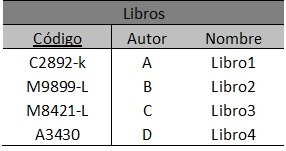

**Llave primaria compuesta:** Como su nombre lo dice es una llave primaria compuesta por varios atributos de una tabla generalmente una llave primaria compuesta está formada por dos llaves foráneas de la tabla.

Ejemplo:

.. figure:: nstatic/imgModeloDatos8.jpg
   :align: center

**Llave foránea:** es el atributo de una entidad que existe como dependencia en otra entidad, cuyos valores en las tuplas deben coincidir con valores de una llave que debe ser primaria de las tuplas de otra relación.

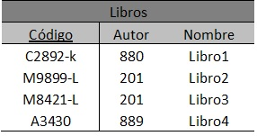

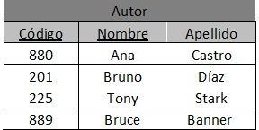

En este caso la llave primara para identificar los libros es compuesta, El Código es propio del Libro y el Autor del Libro es la llave foránea, esta llave foránea es el código de Autor que es único en la tabla de Autor, pero en la tabla de  Libros pueden repetirse, ya que hay libros que son escritos por un mismo autor.

**3. Tipos de relaciones**
---------------------------
^^^^^^^^^^^^^^^^^^^^^^^^^^^

Existen diferentes tipos de relaciones según tengan parte las entidades en ellas. Las relaciones están dadas por el enunciado, como en el ejemplo anterior podemos analizar que cada empleado puede tener solamente un cargo, pero varios empleados pueden tener el mismo cargo.

La cardinalidad se miden con un mínimo y un máximo al lado de la entidad, en ese orden respectivamente. (min,max).

**3.1 Relación uno a uno:** una entidad se relaciona únicamente con otra entidad y viceversa. Por ejemplo, si tenemos una entidad chasis y otra con matrículas del chasis del auto, debemos determinar que cada chasis solo puede tener una matrícula y una matrícula solo puede existir en un chasis especifico.

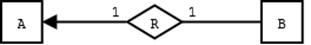

Seleccionando el máximo en cada carnalidad se toma a 1 para esta representación, se leen las reglas de negocio como: Un chasis tiene una matrícula. Una Matricula única está en un solo chasis.

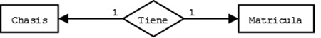

A y B son una entidad, R es la relación que tienen.

**3.2 Uno a varios:** una entidad puede estar asociada con varias entidades, pero en esta segunda entidad, la primera existir solo una vez. 

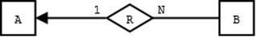

Un ejemplo concreto sería:

Las reglas de negocio se leerían como: A un estudiante se le pueden prestar varios libros. Varios libros pueden ser prestados únicamente a un estudiante.

Al pasar de una relación de modelo entidad-relación a modelo relacional, se toma como llave primaria de la relación, la llave primaria de la relación de cardinalidad N.

Si tenemos Estudiante(ID, Nombre, Apellido) y Libro(Código, Nombre, Autor), La llave primaria de la relación va a ser Código de libro.

**3.3 Varios a varios:** una entidad puede estar asociada con otra con ninguno o varias entidades y viceversa. 

En este caso se pueden leer las reglas de negocio como: A varios estudiantes se les puede prestar varios libros. Varios libros pueden ser prestados a varios estudiantes.

Al pasar este modelo entidad-relación a las bases de datos relacionales, se deben cambiar las cardinalidades de las relaciones, los modelos relaciones soportan cardinalidades de 1 a N.

Al pasar de una relación de N a N a modelo relacional, la llave primaria de la relación es una llave primaria compuesta conformada por las llaves primarias de las relaciones.

Si tenemos Estudiante(ID, Nombre, Apellido) y Libro(Código, Nombre, Autor), La llave primaria de la relación va a ser (ID, Código) de libro.

**4. Conceptos sobre relaciones**
-----------------------------------
^^^^^^^^^^^^^^^^^^^^^^^^^^^^^^^^^^^

**4.1. Relación R(Ai..An)**

Es un un subconjunto del producto cartesiano D1×..×Dn , donde D son tablas del modelo de datos.

Es importante recordar que en una relación hay que distinguir dos aspectos:

**4.2. Esquema de la relación:** Los atributos A1...An

p.ej. Trabajadores (id_trabajador, nombre, tarifa_hr, tipo_de_oficio, id_supv).

**4.3. Instancia de la relación:** El conjunto de tuplas {(X1, x2,.., xn)} ⊆ D1×D2×...×Dn que la componen en cada momento. 

**4.4. Restricción de integridad:** Es una condición necesaria para preservar la corrección semántica de la base de datos.

**4.5. Esquema de la base de datos:** Colección de esquemas de relaciones junto con las restricciones de integridad que se definen sobre las relaciones.7

**4.6 Dominio (en el contexto del modelo relacional)**
Conjunto de valores atómicos.

**5. Restricciones de integridad asociadas a las relaciones de la base de datos**
----------------------------------------------------------------------------------
^^^^^^^^^^^^^^^^^^^^^^^^^^^^^^^^^^^^^^^^^^^^^^^^^^^^^^^^^^^^^^^^^^^^^^^^^^^^^^^^^^

Una base de datos contiene datos que mayormente deben reflejar la realidad o bien la situación de una del mundo real dado por las reglas del negocio. En el caso de las bases de datos relacionales, esto significa que la extensión de las relaciones (es decir, las tuplas que contienen las relaciones) deben tener valores que reflejen la realidad correctamente.

Suele ser bastante frecuente que determinadas configuraciones de valores para las tuplas de las relaciones no tengan sentido, porque no representan ninguna situación posible del mundo real.

**Restricciones de integridad asociadas a las tuplas de una relación:**

Los datos que se ingresen a las tablas en las tuplas deben tener un sentido lógico representativo, algo de acuerdo con la realidad.

Ejemplo

     En el caso de ingresar una edad, debe cumplir con las condiciones: 
     
     0 ≤ edad ≤ 120.
  
     En el caso de ingresar los impuestos, debe cumplir con la condición: 

     impuestos ≤ sueldo.

**Las restricciones de integridad de usuario:** son condiciones específicas de una base de datos concreta; es decir, son las que se deben cumplir en una base de datos particular con unos usuarios concretos, pero que no son necesariamente relevantes en otra base de datos.

Ejemplo:

Dada una tabla de empleados con un atributo sueldo, según la cual los sueldos no podían ser negativos. Hay que tomar en cuenta que este caso en la base de datos tiene el atributo sueldo, al que se quería dar un valor; sin embargo, podría no ser necesaria en otra base de datos diferente donde, por ejemplo, no hubiese sueldos.

**Las reglas de integridad de modelo:** son condiciones más generales, propias de un modelo de datos, y se deben cumplir en toda base de datos que siga dicho modelo.

Ejemplo:

En el caso del modelo de datos relacional, habrá una regla de integridad para garantizar que los valores de una clave primaria de una relación no se repitan en tuplas diferentes de la relación. Toda base de datos relacional debe cumplir esta regla que, por lo tanto, es una regla de integridad del modelo.

Los SGBD deben proporcionar la forma de definir las restricciones de integridad de usuario de una base de datos; una vez definidas, deben velar por su cumplimiento, la manera de hacer esto es mediante restricciones en el lenguaje SQL.

Las reglas de integridad del modelo, no se deben definir para cada base de datos concreta, porque se consideran preestablecidas para todas las bases de datos de un modelo. Un SGBD de un modelo determinado debe velar por el cumplimiento de las reglas de integridad preestablecidas por su modelo. 

Seguidamente vamos a estudiar con detalle las reglas de integridad del modelo relacional, reglas que todo SGBD relacional debe obligar a cumplir.

**5.1. Regla de integridad de unicidad de la clave primaria**

La regla de integridad de unicidad está relacionada con la definición de clave
primaria. Concretamente, establece que toda clave primaria que se elija para
una relación no debe tener valores repetidos.

Ejemplo:

.. figure:: nstatic/imgModeloDatos8.jpg
   :align: center

En este ejemplo el edificio y la sede son la llave primaria, puede haber varios edificios llamados “Correos CR” pero solo 1 asociado a una “Sede” especifica. Quiere decir que se establece que, si la llave primaria es compuesta o simple, sea la clave primaria de una relación, entonces la extensión de esta no puede tener en ningún momento dos tuplas con la misma combinación de valores en la llave primaria.

**5.2. Regla de integridad de entidad de la clave primaria**

Los atributos de la clave primaria de una relación no pueden tener valores nulos. 

Ejemplo

Tenemos la siguiente relación:

.. figure:: nstatic/imgModeloDatos9.jpg
   :align: center

En esta relación, puesto que la clave primaria está formada por edificio y sede, no hay ningún envió que tenga un valor nulo para edificio, ni tampoco para número. Esta regla es necesaria para que los valores de las claves primarias puedan identificar las tuplas individuales de las relaciones. Si las claves primarias tuvieran valores nulos, es posible que algunas tuplas no se pudieran distinguir. 

**5.3. Regla de integridad referencial**

Esta regla se relaciona directamente con el concepto de llave foránea. Determina que todos los valores que toma una clave foránea deben ser valores nulos o valores que existen en la clave primaria que referencia.

La necesidad de la regla de integridad relacional proviene del hecho de que las llaves foráneas tienen por objetivo establecer una conexión con la clave primaria que referencian. Si un valor de una llave foránea no estuviese presente en la clave primaria correspondiente, representaría una referencia o una conexión incorrecta.

Un SGBD relacional tendrá que hacer cumplir esta regla de integridad. Deberá realizar las comprobaciones cuando se produzcan las siguientes operaciones:

a) Inserciones en una relación que tenga una clave foránea.
b) Modificaciones que afecten a atributos que pertenecen a la clave foránea de una relación.
c) Borrados en relaciones referenciadas por otras relaciones.
d) Modificaciones que afecten a atributos que pertenecen a la clave primaria de una relación referenciada por otra relación.

La integridad referencial mantiene las conexiones en las bases de datos relacionales. Es decir que si se refiere a una entidad con llave foránea, esta no se puede eliminar, si se modifica la llave se modifica en la tabla a la que se refiere.

Ejemplos:

        imparte.NRP ∈  profesor.NRP
 
        El profesor que imparte una asignatura debe existir en la tabla de profesores.

        cuenta.sucursal ∈ sucursal.numero

        Una cuenta tiene que pertenecerá una sucursal existente.

.. figure:: nstatic/imgModeloDatos10.jpg
   :align: center

En este caso para mantener la integridad referencial no se debe eliminar el padre.

**5.4. Regla de integridad de dominio**

La regla de integridad de dominio está relacionada, como su nombre indica, con la noción de dominio. Esta regla establece dos condiciones.

•	La primera condición consiste en que un valor no nulo de un atributo Ai debe pertenecer al dominio del atributo Ai; es decir, debe pertenecer a dominio(Ai).

Esta condición implica que todos los valores no nulos que contiene la base de datos para un determinado atributo de una tabla, deben ser del dominio declarado para dicho atributo.

Ejemplo
	Si en una relación de Empleados(ID,nombre,apellido,sueldo), se define el atributo ID como un entero de 9 digitos, no podemos ingresar en la tabla el valor “Ana”, ya que no es un entero 

•	La segunda condición sirve para establecer que los operadores que pueden aplicarse sobre los valores dependen de los dominios de estos valores; es decir, un operador determinado sólo se puede aplicar sobre valores que tengan dominios que le sean adecuados.

Ejemplo
	Si en la relación EMPLEADOS(ID, nombre, apellido, edademp) se ha declarado que dominio(ID) es el dominio predefinido de los enteros, entonces no se permitirá consultar todos aquellos empleados cuyo ID sea igual a ‘Ana’ (DNI = ‘Ana’). El motivo es que no tiene sentido que el operador de comparación = se aplique entre un DNI que tiene por dominio los enteros, y el valor ‘Ana’, que es una serie de caracteres.

**6. Normalización**
----------------------
^^^^^^^^^^^^^^^^^^^^^^

La normalización es un proceso que se realiza en las bases de datos para designar y aplicar una serie de reglas a las relaciones y restricciones ya estudiadas anteriormente, que se encuentren al pasar de un modelo Entidad-Relación a un modelo Relacional. 

Una base de datos se normaliza por las siguientes razones:

•	Proteger la integridad de los datos.
•	Evitar que haya redundancia de datos.
•	Para disminuir la probabilidad de que se den problemas de actualización de datos.

**6.1 Dependencia funcional**

Definición: Sean Xi y Yi subconjuntos de atributos de una relación. Yi tiene una dependencia funcional de Xi, también Xi determina a Yi, si cada valor de Xi tiene asociado siempre un único valor del subconjunto Yi. 

De manera más simple, se puede ver como la conexión entre uno o más atributos de una entidad con otra. Se puede expresar como, un conjunto que puede ser expresado en otras funciones.

.. figure:: nstatic/imgModeloDatos.jpg
   :align: center

**6.1.1 Tipos de Dependencias Funcionales**

**a) Dependencia Total:** se dice que ocurre dependencia total si se tiene un “y” que solo dependa de un “x” y no de ningún otro atributo.

x → y

**b) Dependencia Parcial:** esta dependencia ocurre cuando un “y” depende de manera parcial de 2 atributos un “xz” y un “z”.

xz → y

z → y

A la hora de resolver esta dependencia generaría una solución de esta manera: 
{(x, y), (y, z)}.

**c) Dependencia Transitiva**: es cuando un “y” depende de un “x”, pero que también hay un “z” que depende de ese “y”; por lo tanto, por medio de esta dependencia se dice que el “c” depende de “x”.

x → y 

y → z

Transitividad x → z

Una tabla se da por normaliza cuando se cumple el teorema de “Descomposición de Producto sin Pérdida”, el cual se puede definir de la siguiente manera:

 Sea R [x, y, z] y se verifica que “y → z”, entonces: 

R = R1 [x, y] U R2 [y, z]
 
Para que una tabla esté normalizada tienen estar aplicadas al menos las 3 primeras formas normales, ya que se dice que una base de datos está normalizada si la base está en forma N, es decir que sus tablas están en forma normal N.

**Primera Forma Normal (1FN)**: No debe tener grupo repetitivos.

Ejemplo:

	Analizaremos el caso donde en una tabla de estudiantes se presenta un grupo repetido.

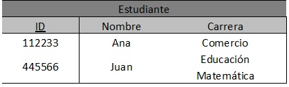

Aquí la tabla está bien pero no en 1FN, ya que Juan en la Carrera tiene 2 carreras en una misma celda, se podrían poner en una misma celda de caracteres, pero no quiere decir que este en forma relacional. La manera correcta de construir esta tabla es la siguiente:

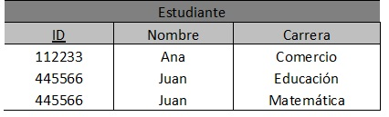

Aquí las carreras de Juan están separadas en 2 tuplas. Lo que hace cumplir con la 1FN.

**Segunda Forma Normal (2FN):** Ocurre si la tabla está en 1FN y además cada atributo que no sea llave depende funcionalmente respecto de cualquiera de las llaves. Se da si no hay dependencia Parcial.

Toda la llave primaria debe hacer dependiente al resto de atributos, si hay atributos que dependen solo de parte de la llave primaria, entonces esa parte de la llave y esos atributos formarán otra tabla.

Ejemplo:

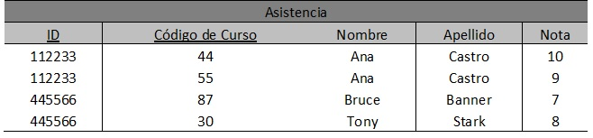

Esta tabla está en 1FN, ahora vamos a pasarla a 2FN.

Suponiendo que el ID y Código de Curso formen una llave primaria para esta tabla, sólo la nota tiene dependencia funcional completa, el nombre y el apellido dependen de forma completa del ID, no de toda la llave primaria. Para solucionar esto se debe:

Ahora solo la nota depende totalmente de la llave primaria en la Tabla asistencia, la tabla profesor tiene el Nombre y Apellido, que existe una dependencia completa sobre el ID de profesor.

**Tercera Forma Normal (3FN):** Ocurre cuando una tabla está en 2FN y además ningún atributo que no sea clave depende transitivamente de las claves de la tabla. Es decir, no ocurre cuando algún atributo depende funcionalmente de atributos que no son clave. No debe haber dependencias entre los mismos atributos. 

Ejemplo:

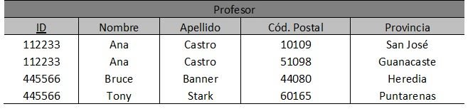

En esta tabla la provincia depende funcionalmente del código postal, lo que hace que no esté en 3FN. Para solucionarlo:
 
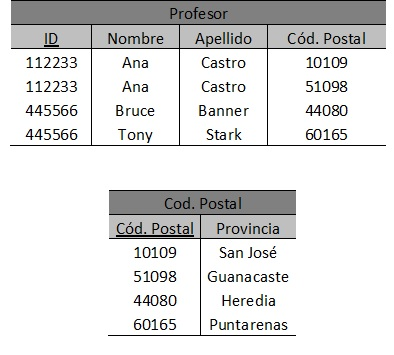

Ahora la provincia no está en la tabla de profesor y está en la tabla código postal, donde hay una depende completa con el Cód. Postal de la tabla.

Ejemplo:

Se desarrollará un ejemplo con atributos de una tabla de forma más genérica.

Sea T( a, b, c, d, e, f, g, h) la tabla con sus atributos.

f={ a→e, a→b,a→c, f→d, a→g, g→h },

::

 T ( a , f , g )
 T1 ( a, e , b , c , g )
 T1.2 ( f , d )
 T2 ( g , h )

De acuerdo a lo planteado anteriormente podemos llegar a la conclusión de que la normalización de los datos puede considerarse como un proceso durante el cual los esquemas de relación insatisfactorios se descomponen repartiendo sus atributos entre esquemas de relación más pequeños que poseen propiedades deseables sin dependencias que no son necesarias.

Ahora se sabe con certeza que para pasar de un modelo Entidad-Relacion, es necesario que la base de datos esté en 3FN, al cumplir con la tercena forma normal también garantiza un buen funcionamiento de la bese de datos

Una ventaja clara para las bases de datos relacionales al normalizarse es la optimización del espacio en la memoria física y un mejor manejo de datos a la hora de hacer consultas SQL estructurado y manejable, reduciendo posibles errores de datos como redundancia de datos.

