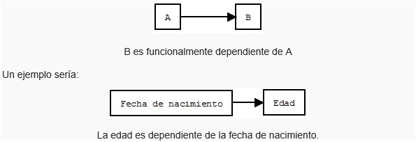
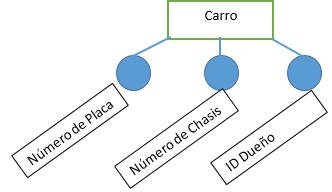
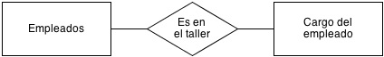
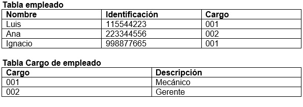
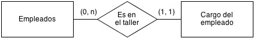
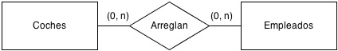
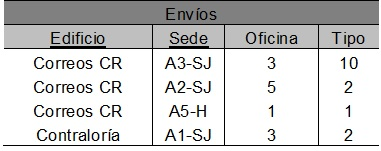
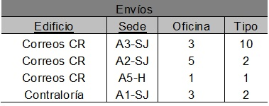
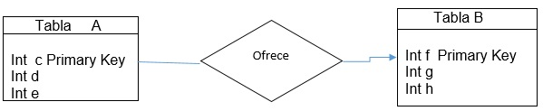

Modelo de datos
======================

Antes de comenzar con las indicaciones sobre cómo realizar el modelo de datos para la base de datos es importante tener bien claro que es un modelo de datos.

Un modelo de datos es un conjunto de herramientas conceptuales para la descripción de los datos y  las relaciones entre ellos, su semántica y las restricciones de consistencia. Ahora bien en este manual se utilizara el modelo de datos relacional esto dado que su simplicidad facilita el trabajo del programador en comparación con otros modelos. Sin embargo, primero se desarrollará un modelo basado en Entidad-Relación el cual después será trasformado finalmente en el Relacional, ya que E-R sirve para modelar el problema y reglas de negocio.

También a continuación se muestran algunos conceptos importantes relacionados con el diseño del modelo de bases de datos y también con respecto a integridad en las relaciones y base de datos antes de iniciar con el diseño del modelo.

**1. Dependencias**
----------------------
^^^^^^^^^^^^^^^^^^^^^^

**1.1 Dependencia funcional**

Es la conexión entre uno o más atributos de una entidad con otra. Se puede expresar como, un conjunto que puede ser expresado en otras funciones.

**2. Modelo Entidad-Relación a Relacional**
----------------------------------------------
^^^^^^^^^^^^^^^^^^^^^^^^^^^^^^^^^^^^^^^^^^^^^^

Este modelo es solamente un método que se aprovecha para diseñar los esquemas que posteriormente se deben implementar en la Base de datos. Este modelo se representa a través de diagramas y está formado por varios elementos que se analizarán a continuación.

Este modelo además de tener un diagrama que ayuda a entender los datos y como se relacionan entre ellos, tiene que ser completado con la lista de los atributos y relaciones de cada elemento.

**2.1. Entidad:** Cada entidad representa cosas y objetos ya sean reales o abstractos que se diferencian entre sí. En un diagrama las entidades se representan con rectángulos.

**2.2. Atributos:** Los atributos definen las características de las entidades, son las propiedades de cada una. Cada entidad contiene distintos atributos, que dan información sobre esta entidad. Estos atributos pueden ser de distintos tipos (numéricos, texto, fecha...). Cada una de las columnas de una tabla. En un diagrama los atributos se representan con círculos que descienden de la entidad.

**2.3.Tupla:** La tupla son elementos formados por una fila de una tabla. Cada fila está de la entidad estaría compuesta por los atributos de la entidad correspondiente.

**2.4 El concepto de relación**

Una relación es lo que nos permite definir qué tipo de dependencia se debe dar entre entidades, es decir nos permite decir que ciertas entidades comparten ciertos atributos de manera necesaria.

Para manejarlo de una manera más gráfica se puede ver en un diagrama y en una tabla, los diagramas siempre se van a definir según las reglas del negocio.

Enunciado: los empleados de un taller tienen un cargo asociado. 

Es decir, si un atributo de la entidad “Empleados” especifica que cargo tiene en el taller.

El cargo que ejerce debe coincidir con el que existe en la tabla de “cargos. 

**3. Tipos de relaciones**
---------------------------
^^^^^^^^^^^^^^^^^^^^^^^^^^^

Existen diferentes tipos de relaciones según tengan parte las entidades en ellas. Las relaciones están dadas por el enunciado, como en el ejemplo anterior podemos analizar que cada empleado puede tener solamente un cargo, pero varios empleados pueden tener el mismo cargo.

La cardinalidad se miden con un mínimo y un máximo al lado de la entidad, en ese orden respectivamente. (min,max).

**3.1 Relación uno a uno:** una entidad se relaciona únicamente con otra entidad y viceversa. Por ejemplo, si tenemos una entidad chasis y otra con matrículas del chasis del auto, debemos determinar que cada chasis solo puede tener una matrícula y una matrícula solo puede existir en un chasis especifico.

**3.2 Uno a varios:** una entidad puede estar asociada con varias entidades, pero en esta segunda entidad, la primera existir solo una vez. Como ha sido en el caso anterior del empleado del taller.

**3.3 Varios a varios:** una entidad puede estar asociada con otra con ninguno o varias entidades y viceversa. Se puede apreciar con un ejemplo, en el taller un auto puede ser reparado por varios mecánicos a la vez y esos mecánicos pueden reparar varios autos distintos.

**4. Llaves en las relaciones**
--------------------------------
^^^^^^^^^^^^^^^^^^^^^^^^^^^^^^^^

Una llave es un atributo de una entidad, a la cual hace distinguir a esta entidad de los demás registros. Primeramente, debemos saber cuáles son los tipos de llaves que existen en una entidad y como se pueden relacionar con otras entidades.

**4.1 Llave primaria:** Es un atributo (o columna) que restringe y distingue a las tuplas para que no se repitan en la misma entidad. La clave primaria es única. En algunos casos puede ser dos atributos lo cual conlleva al siguiente concepto. 

**4.2 Llave primaria compuesta:** Como su nombre lo dice es una llave primaria compuesta por varios atributos de una tabla generalmente una llave primaria compuesta está formada por dos llaves foráneas de la tabla.

**4.3 Llave foránea:** es el atributo de una entidad que existe como dependencia en otra entidad, cuyos valores en las tuplas deben coincidir con valores de una llave que debe ser primaria de las tuplas de otra relación.

**5. Conceptos sobre relaciones**
-----------------------------------
^^^^^^^^^^^^^^^^^^^^^^^^^^^^^^^^^^^

**5.1. Relación R(Ai..An)**

Es un un subconjunto del producto cartesiano D1×..×Dn , donde D son tablas del modelo de datos.

Es importante recordar que en una relación hay que distinguir dos aspectos:

**5.2. Esquema de la relación:** Los atributos A1...An

p.ej. Trabajadores (id_trabajador, nombre, tarifa_hr, tipo_de_oficio, id_supv).

**5.3. Instancia de la relación:** El conjunto de tuplas {(X1, x2,.., xn)} ⊆ D1×D2×...×Dn que la componen en cada momento. 

**5.4. Restricción de integridad:** Es una condición necesaria para preservar la corrección semántica de la base de datos.

**5.5. Esquema de la base de datos:** Colección de esquemas de relaciones junto con las restricciones de integridad que se definen sobre las relaciones.7

**6.6 Dominio (en el contexto del modelo relacional)**
Conjunto de valores atómicos.

**Bases de datos relacionales**

En  algunas ocasiones, no se conoce el valor de un atributo para una determinada tupla. En esos casos, a ese atributo de esa tupla se le asigna un valor nulo (null), que indica que el valor de ese atributo es desconocido o, simplemente, que ese atributo no es aplicable a esa tupla.

**6. Restricciones de integridad asociadas a las relaciones de la base de datos**
----------------------------------------------------------------------------------
^^^^^^^^^^^^^^^^^^^^^^^^^^^^^^^^^^^^^^^^^^^^^^^^^^^^^^^^^^^^^^^^^^^^^^^^^^^^^^^^^^

Una base de datos contiene datos que mayormente deben reflejar la realidad o bien la situación de una del mundo real dado por las reglas del negocio. En el caso de las bases de datos relacionales, esto significa que la extensión de las relaciones (es decir, las tuplas que contienen las relaciones) deben tener valores que reflejen la realidad correctamente.

Suele ser bastante frecuente que determinadas configuraciones de valores para las tuplas de las relaciones no tengan sentido, porque no representan ninguna situación posible del mundo real.

**Restricciones de integridad asociadas a las tuplas de una relación:**

Los datos que se ingresen a las tablas en las tuplas deben tener un sentido lógico representativo, algo de acuerdo con la realidad.

Ejemplo

     En el caso de ingresar una edad, debe cumplir con las condiciones: 
     
     0 ≤ edad ≤ 120.
  
     En el caso de ingresar los impuestos, debe cumplir con la condición: 

     impuestos ≤ sueldo.

**Las restricciones de integridad de usuario:** son condiciones específicas de una base de datos concreta; es decir, son las que se deben cumplir en una base de datos particular con unos usuarios concretos, pero que no son necesariamente relevantes en otra base de datos.

Ejemplo:

Dada una tabla de empleados con un atributo sueldo, según la cual los sueldos no podían ser negativos. Hay que tomar en cuenta que este caso en la base de datos tiene el atributo sueldo, al que se quería dar un valor; sin embargo, podría no ser necesaria en otra base de datos diferente donde, por ejemplo, no hubiese sueldos.

**Las reglas de integridad de modelo:** son condiciones más generales, propias de un modelo de datos, y se deben cumplir en toda base de datos que siga dicho modelo.

Ejemplo:

En el caso del modelo de datos relacional, habrá una regla de integridad para garantizar que los valores de una clave primaria de una relación no se repitan en tuplas diferentes de la relación. Toda base de datos relacional debe cumplir esta regla que, por lo tanto, es una regla de integridad del modelo.

Los SGBD deben proporcionar la forma de definir las restricciones de integridad de usuario de una base de datos; una vez definidas, deben velar por su cumplimiento, la manera de hacer esto es mediante restricciones en el lenguaje SQL.

Las reglas de integridad del modelo, no se deben definir para cada base de datos concreta, porque se consideran preestablecidas para todas las bases de datos de un modelo. Un SGBD de un modelo determinado debe velar por el cumplimiento de las reglas de integridad preestablecidas por su modelo. 

Seguidamente vamos a estudiar con detalle las reglas de integridad del modelo relacional, reglas que todo SGBD relacional debe obligar a cumplir.

**6.1. Regla de integridad de unicidad de la clave primaria**

La regla de integridad de unicidad está relacionada con la definición de clave
primaria. Concretamente, establece que toda clave primaria que se elija para
una relación no debe tener valores repetidos.

Ejemplo:

En este ejemplo el edificio y la sede son la llave primaria, puede haber varios edificios llamados “Correos CR” pero solo 1 asociado a una “Sede” especifica. Quiere decir que se establece que, si la llave primaria es compuesta o simple, sea la clave primaria de una relación, entonces la extensión de esta no puede tener en ningún momento dos tuplas con la misma combinación de valores en la llave primaria.

**6.2. Regla de integridad de entidad de la clave primaria**

Los atributos de la clave primaria de una relación no pueden tener valores nulos. 

Ejemplo

Tenemos la siguiente relación:

En esta relación, puesto que la clave primaria está formada por edificio y sede, no hay ningún envió que tenga un valor nulo para edificio, ni tampoco para número. Esta regla es necesaria para que los valores de las claves primarias puedan identificar las tuplas individuales de las relaciones. Si las claves primarias tuvieran valores nulos, es posible que algunas tuplas no se pudieran distinguir. 

**6.3. Regla de integridad referencial**

Esta regla se relaciona directamente con el concepto de llave foránea. Determina que todos los valores que toma una clave foránea deben ser valores nulos o valores que existen en la clave primaria que referencia.

La necesidad de la regla de integridad relacional proviene del hecho de que las llaves foráneas tienen por objetivo establecer una conexión con la clave primaria que referencian. Si un valor de una llave foránea no estuviese presente en la clave primaria correspondiente, representaría una referencia o una conexión incorrecta.

Un SGBD relacional tendrá que hacer cumplir esta regla de integridad. Deberá realizar las comprobaciones cuando se produzcan las siguientes operaciones:

a) Inserciones en una relación que tenga una clave foránea.
b) Modificaciones que afecten a atributos que pertenecen a la clave foránea de una relación.
c) Borrados en relaciones referenciadas por otras relaciones.
d) Modificaciones que afecten a atributos que pertenecen a la clave primaria de una relación referenciada por otra relación.

La integridad referencial mantiene las conexiones en las bases de datos relacionales. Es decir que si se refiere a una entidad con llave foránea, esta no se puede eliminar, si se modifica la llave se modifica en la tabla a la que se refiere.

Ejemplos:

        imparte.NRP ∈  profesor.NRP
 
        El profesor que imparte una asignatura debe existir en la tabla de profesores.

        cuenta.sucursal ∈ sucursal.numero

        Una cuenta tiene que pertenecerá una sucursal existente.

En este caso para mantener la integridad referencial no se debe eliminar el padre.

Ahora que se conocen los anteriores conceptos se procederá a continuar con los primeros pases en el diseño de modelo entidad relación.

1.	Realizar un análisis de requisitos mediante una elicitación de requisitos del sistema.
2.	Conocer las reglas de negocio entre las entidades.
3.	Diseño conceptual  de una base de datos.

**6.4. Regla de integridad de dominio**

La regla de integridad de dominio está relacionada, como su nombre indica, con la noción de dominio. Esta regla establece dos condiciones.

•	La primera condición consiste en que un valor no nulo de un atributo Ai debe pertenecer al dominio del atributo Ai; es decir, debe pertenecer a dominio(Ai).

Esta condición implica que todos los valores no nulos que contiene la base de datos para un determinado atributo de una tabla, deben ser del dominio declarado para dicho atributo.

Ejemplo
	Si en una relación de Empleados(ID,nombre,apellido,sueldo), se define el atributo ID como un entero de 9 digitos, no podemos ingresar en la tabla el valor “Ana”, ya que no es un entero 

•	La segunda condición sirve para establecer que los operadores que pueden aplicarse sobre los valores dependen de los dominios de estos valores; es decir, un operador determinado sólo se puede aplicar sobre valores que tengan dominios que le sean adecuados.

Ejemplo
	Si en la relación EMPLEADOS(ID, nombre, apellido, edademp) se ha declarado que dominio(ID) es el dominio predefinido de los enteros, entonces no se permitirá consultar todos aquellos empleados cuyo ID sea igual a ‘Ana’ (DNI = ‘Ana’). El motivo es que no tiene sentido que el operador de comparación = se aplique entre un DNI que tiene por dominio los enteros, y el valor ‘Ana’, que es una serie de caracteres.

**Integridad Relacional:** En toda relación se requiere de una llave primaria que fije como tal la relación. Las relaciones se dan entre dos tablas únicamente, de cada tabla pueden salir varias relaciones a varias tablas, pero solamente una a la vez.

**Integridad referencial:** Significa que la llave foránea de una tabla de referencia siempre debe referir a una fila válida de la tabla a la que se haga referencia. La integridad referencial garantiza que la relación entre dos tablas permanezca sincronizada durante las operaciones de actualización y eliminación.

**Integridad de dominio:**

**Integridad de entidad:**
Los atributos de la clave primaria no pueden tomar valores nulos, ya que la clave primaria debe permitirnos identificar unívocamente cada tupla de la relación.

