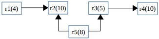
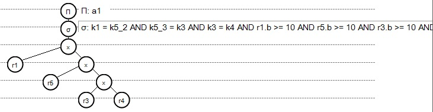
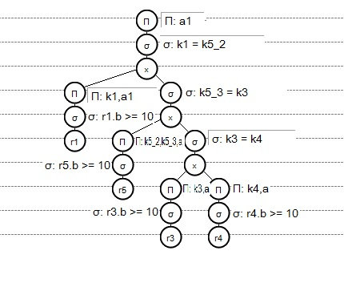

Recomendaciones
================

A continuación  para finalizar el manual se dan algunas recomendaciones básicas para ser tomadas en cuenta finalizado el trabajo de  diseño e implementación de la base de datos, sin embargo es importante tomar en cuenta que lo siguiente son solo algunas sugerencias ya que la principal función de este manual es guiar en el diseño, implementación y documentación de una base de datos pero se considera importante dar algunas referencias para ser tomadas en cuenta en un futuro. También se ha venido hablando en las secciones anteriores del manual la importación de velar por la seguridad de la información que se guarda en una base de datos la cual es muy importante para la empresa o institución en la que se encuentra implementada y un acceso no deseado a la base de datos por agentes externos o internos podrían causar grandes daños  a la compañía o inclusive la decaída en la economía de un país entero. Por ejemplo instituciones como bancos, hospitales, compañías de seguros entre otros contienen datos que son muy valiosos, los cuales deben ser  resguardados de la mejor manera. Sin embargo las siguientes recomendaciones son solamente algunas de las muchas que se deben considerar para mantener la seguridad en una base datos y este es un manual para el diseño y implementación  de una base de datos. A continuación se  enumeran las recomendaciones junto con una breve explicación:

1.	El administrador de la base datos es el único que debe tener acceso a la base de datos. 
2.	El administrador de la base de datos es quién se encarga de ingresar los SQL,  se recomienda utilizar una base datos a escala de la base de datos principal para verificar la eficiencia de las sentencias SQL en esta base  antes de ingresarlos en la base de datos principal.
3.	Solo los administradores de la base de datos deben tener acceso a la documentación de la misma.
4.	Cuando se realiza algún cambio en la base de datos a nivel físico, lógico o en el modelo de datos dicho cambio debe ser actualizado en la documentación de la misma, esto con el fin de que la documentación siempre este actualizada.
5.	Finalmente como última recomendación  es importante fomentar el uso de sentencias SQL optimizadas a continuación se explica un poco de que es optimización y un pequeño ejemplo de optimización.

**Optimización**
 
La optimización es el mejoramiento de consultas en SQL. Esto es una práctica muy utilizada en bases de datos con el fin de obtener datos  mediante consultas SQL en el menor tiempo posible. Es muy importante tomar en cuenta lo anterior porque  hoy en día la velocidad en el acceso a los datos puede marcar diferencia en una compañia, por  lo cual es muy importante tomar en cuenta está práctica ya que por ejemplo en bases de datos de grandes empresas  un acceso más rápido a la información puede hacer esta diferencia, esto porque en bases de datos que almacenan millones de datos, si las consultas SQL no están optimizadas pueden consumir demasiado tiempo, con esto se refiere a horas para obtener algún dato. Por eso importante tomar en cuenta la recomendación de fomentar el uso de sentencias optimizadas. A continuación se explica brevemente un pequeño ejemplo de optimización en donde es importante destacar que se hace el uso de algebra relacional.

A continuación un esquema de lo que sería la base datos y adjunto la consulta que se desea realizar que posteriormente será optimizada. En el siguiente modelo cada relación (r), tiene esquema (k,a,b) siendo k llave primaria o foránea. 

**Consulta** 

Calcular de atributos (a) de r1 relacionados con atributos (a) de r4. Considerando que los valores b > 10 en cada relación se consideran datos erróneos y no pueden ser tomados en cuenta. El valor 4 en r1 indica la cantidad de registros que contiene.

1.	El primer paso es realizar la sentencia SQL sin optimizar.
::

 select a1 
 from r1,r5,r3,r4 
 where k1 = k5_2 
 and k5_3 = k3 
 and k3 = k4 
 and r1.b >= 10 
 and r5.b >= 10 
 and r3.b >= 10 
 and r4.b >= 10;

A partir de esta sentencia SQL se hará la optimización.

2.	Ahora se procede a realizar el árbol de la sentencia no óptima

3.	A partir del árbol anterior se realiza el álgebra relacional de la sentencia SQL no optimizada.

::

 Π{a1}(σ{k1=k5_2 ∧ k5_3=k3 ∧ k3=k4 ∧ r1.b≥10 ∧ r5.b≥10 ∧ r3.b≥10 ∧ r4.b≥10 }(r1 × r5 × r3  × r4))

4.	Ahora se procede a realizar un árbol mejorado partiendo también del árbol del punto 2 esto analizando los costos de datos que consumía el árbol del paso 2.

5.	A partir del árbol que se realizó en el paso 5 se hace el álgebra relacional.
::

 R1 ←σ{k3=k4 }(Π{k3,a }(σ{r3.b≥10}(r3)) ×  Π{k4,a}(σ{r4.b≥10}(r4))) 
 R2 ←σ{k5_3=k3}(Π{k5_2,k5_3,a}(σ{r5.b≥10} (r5)) × R1) 
 R3 ←Π{a1}(σ{k1=k5_2}(Π{k1,a1}(σ{r1.b≥10} (r1)) × R2))

6.	 Finalmente está sería la sentencia SQL optimizada 
::

 SELECT a1 FROM (SELECT k1,a1 FROM r1 WHERE r1.b >= 10)alias1 , 
  (SELECT * FROM (SELECT k5_2,k5_3,a FROM r5 WHERE r5.b >= 10)alias2 , 
     (SELECT * FROM (SELECT k3,a FROM r3 WHERE r3.b >= 10)alias3 , 
         (SELECT k4,a FROM r4 WHERE r4.b >= 10)alias4  
          WHERE k3 = k4
	 )alias5  
	 WHERE k5_3 = k3
 )alias6  
 WHERE k1 = k5_2;

Nota: Para la optimización se utilizó el software RAT (Relational Algebra Translator), el cual es muy recomendado para generación de la sentececia en álgebra relacional a partir de una consulta. El software se puede obtener en el siguiente enlace http://www.slinfo.una.ac.cr/rat/rat.html

